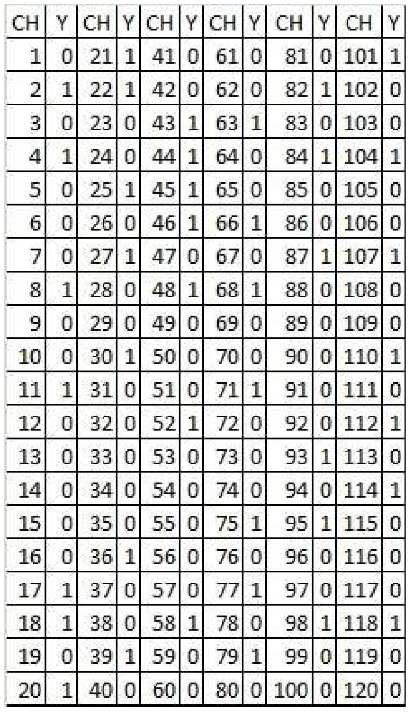

---
header-evals:
- \usepackage{longtable}
- \usepackage[utf8]{inputenc}
- \usepackage[spanish]{babel}\decimalpoint
#- \setlength{\parindent}{1.25cm}
- \usepackage{amsmath}
output:
  pdf_document:
    number_sections: true
fontsize: 12pt
papersize: letter
#geometry: margin = 1in
language: "es"
lang: es-ES
---

```{r setup, echo=FALSE}
knitr::opts_chunk$set(warning = FALSE,
                      message = FALSE,
                      echo = FALSE)
```

```{r}
library(kableExtra)
library(tidyverse)
```


```{=tex}
\pagestyle{myheadings}
\input{DocumentFormat/titlepage}
\thispagestyle{empty}
\tableofcontents
\listoffigures
\listoftables
\newpage
```
\setcounter{page}{2}

```{=tex}
\begin{center}
\textbf{Tarea 1}
\end{center}
```
Suponga que los datos mostrados en la siguiente tabla corresponde al registro de 120 hogares que conforman un Barrio a quienes se les preguntó si tenían adultos mayores (60 o más años). **1:** Corresponde a un hogar que cumple con el atributo. Seleccione una **MAS** de **15** hogares.

{width="289"}

\section{Indique la forma como seleccionó la MAS y registre los respectivos valores.}

```{r}
set.seed(1)
N <- 120 #Total de hogares
n <- sort(sample(1:N, 15)) #Muestra 
```

Usando el software estadístico R y la función sample(), se procede a sacar una muestra aleatorea sin remplazo, garantizando que cualquier hogar tendrá la misma probabilidad de ser seleccionado en el estudio. Ademas se fija una semilla = **1** con el fin de permitir reproducibilidad del estudio.

La muestra aleatoria es la siguiente:

```{r}
y <- c(0, 0, 1, 0, 1, 1, 0, 0, 1, 1, 0, 1, 0, 0)
data <- cbind(n, y) %>% as.data.frame()
kable(t(data), caption = "Tabla de la Muestra Aleatoria") %>% 
  kable_styling(latex_options = "HOLD_position")
```


\section{Con la muestra seleccionada, estime la proporción de hogares que tienen adultos mayores y halle el respectivo intervalo de confianza 97\% usando la aproximación Binomial y la Hipergeométrica.}


Se procede a filtrar los hogares que tienen adultos mayores los cuales son: 

```{r}
query <- data %>% filter(., y == 1)
a <- nrow(query)
kable(t(query), caption = "Tabla Adultos mayores") %>% 
  kable_styling(latex_options = "HOLD_position")
```

Como se puede observar en la muestra aleatorio cuentan con 6 hogares que tienen 
adultos mayores. Se procede a realizar los respectivos intervalos de confianza. 


Tenemos: 

- **N** = 120

- **n** = 15

- **$\alpha$** = 0.03 

Basados en lo anterior, procedemos a calcular los intervalos de confianza aproximados. 


\subsection{Intervalo de confianza usando la aproximación Binomial}

```{r}
Ls.conf.binom.prop <- function(pp,a,alfa,n){
  pbinom(a,size = n, prob = pp)-alfa*0.5
}

Li.conf.binom.prop <- function(pp,a,alf,n){
  1-pbinom(a-1,size = n, prob = pp)-alf/2
}
```


```{r}
N <- 120 
n <- 15
alf <- 0.03


intervalolsb <- seq(a/n, 1, 0.0001)
intervalolib <- seq(0, a/n, 0.0001)

ysb <- apply(matrix(intervalolsb,ncol=1), 1,
            Ls.conf.binom.prop,a,alf,n)

yib <- apply(matrix(intervalolib,ncol=1), 1,
            Li.conf.binom.prop,a,alf,n)
```


```{r}
library(ggplot2)
library(gridExtra)
# Hacemos los respectivos graficos de los intervalos de busqueda:
p1 <- ggplot(,aes(intervalolsb,ysb))+geom_line(size=1, colour="red")+
  geom_hline(yintercept = 0, colour="blue")+
  labs(title = "Intervalo Superior")

p2 <- ggplot(,aes(intervalolib,yib))+geom_line(size=1, colour="green")+
  geom_hline(yintercept = 0, colour="blue")+
  labs(title = "Intervalo Inferior")

grid.arrange(p2,p1,ncol=2)
```


```{r}
ind1 <- which((abs(ysb)<0.0001))
mb1 <- matrix(c(intervalolsb[ind1],ysb[ind1]), ncol = 2)
kable(mb1, col.names = c("Proporción", "Error Absoluto"), caption = "Limite Superior") %>% 
   kable_styling(latex_options = "HOLD_position")
maxb <- mb1[abs(mb1[,2])==min(abs(mb1[,2])),]
maxb <- maxb[1]
```


Se toma como limite superior = **0.7007**.

```{r}
#Lower
ind2 <- which((abs(yib)<0.0001))

mb2 <- matrix(c(intervalolsb[ind2],yib[ind2]), ncol = 2)
kable(mb2, col.names = c("Proporción", "Error Absoluto"), caption = "Limite Inferior") %>% 
   kable_styling(latex_options = "HOLD_position")
minb <- mb2[abs(mb2[,2])==min(abs(mb2[,2])),]
minb <- minb[1]
```

Se toma como limite inferior = **0.5464**.

El intervalo de confianza del 97% usando la aproximación Binomial es:

**( 0.5464 , 0.7007 )**

```{r, eval = FALSE}
paste("(", minb, ",", maxb,")")
```

\subsection{Intervalo de confianza usando la aproximación Hipergeometrica}

```{r}
Ls.conf.hiper.prop <- function(A,a,N,n,alfa){
  phyper(a,A,N-A,n)-alfa*0.5
}

Li.conf.hiper.prop <- function(A,a,N,n,alf){
  1-phyper(a-1,A,N-A,n)-alf/2
}
```

```{r}
intervalolsh <- seq(a/n *N, 100,1)
intervalolih <- seq(0,a/n * N,1)

ysh <- apply(matrix(intervalolsh,ncol=1), 1,
            Ls.conf.hiper.prop,a,N,n,alf)

yih <- apply(matrix(intervalolih,ncol=1), 1,
            Li.conf.hiper.prop,a,N,n,alf)
```

```{r}
p1 <- ggplot()+geom_line(aes(intervalolsh, ysh),colour="red")+
  geom_hline(yintercept = 0, colour="blue")+
  labs(title = "Intervalo Superior [Hyper]")

p2 <- ggplot(,aes(intervalolih,yih))+geom_line(size=1, colour="green")+
  geom_hline(yintercept = 0, colour="blue")+
  labs(title = "Intervalo Inferior [Hyper]")

grid.arrange(p2,p1,ncol=2)
```

```{r}
ind1 <- which((abs(ysh)<0.01))

mh1 <- matrix(c(intervalolsh[ind1],ysh[ind1]), ncol = 2)
kable(mh1, col.names = c("A", "Error Absoluto"), caption = "Limite Superior") %>% 
   kable_styling(latex_options = "HOLD_position")
maxh <- mh1[abs(mh1[,2])==min(abs(mh1[,2])),]
maxh <- maxh[1]
```

Se toma como limite superior = **82**.

```{r}
#Lower
ind2 <- which((abs(yih)<0.01))

mh2 <- matrix(c(intervalolsh[ind2],yih[ind2]), ncol = 2)
kable(mh2, col.names = c("A", "Error Absoluto"), caption = "Limite Inferior") %>% 
   kable_styling(latex_options = "HOLD_position")
minh <- mh2[abs(mh2[,2])==min(abs(mh2[,2])),]
minh <- minh[1]
```


Se toma como limite inferior = **67**.

El intervalo de confianza del 97% usando la aproximación Binomial es:

**( 0.5583 , 0.6833)**

```{r, eval = FALSE}
paste("(", minh/N, ",", maxh/N,")")
```

\section{Repita el punto anterior para el número de hogares en el barrio bajo
estudio que tienen adultos mayores}

Para estimar el numero total de hogares que cuentan con la característica de 
tener adultos mayores, bastaría con multiplicar **N** por cada limite del intervalo
aproximado binomial seleccionado en el literal anterior. Dando como resultado:

- Utilizando la aproximación binomial, el intervalo de confianza está dado por:

**(66, 85)**
```{r echo=FALSE, eval=FALSE}
snt <- ceiling(maxb*N)
int <- ceiling(minb*N)

cat("(",int,",",snt,")")
```

- Utilizando la aproximación hypergeometrica, el intervalo de confianza está dado por:

**(67, 82)**

```{r echo=FALSE, eval=FALSE}
snA <- maxh
inA <- minh
cat("(",inA,",",snA,")")
```


\section{Cuál de los intervalos es mejor? Argumente.}

Tomaremos como el mejor intervalo, el intervalo con mayor precisión, dicho de otra manera
es el intervalo con menor longitud. Dicho intervalo es el intervalo aproximado
con la hipergeometrica con una longitud de **15** comparado al de la Binomial con **19**.

\section{Anexo}

**Punto 1:**
```{r, echo=TRUE, eval=FALSE}

set.seed(1)
N <- 120 #Total de hogares
n <- sort(sample(1:N, 15)) #Muestra 

y <- c(0, 0, 1, 0, 1, 1, 0, 0, 1, 1, 0, 1, 0, 0)
data <- cbind(n, y) %>% as.data.frame()
```

**Punto 2:**
```{r, echo=TRUE, eval=FALSE}
#Aprox Binomial
Ls.conf.binom.prop <- function(pp,a,alfa,n){
  pbinom(a,size = n, prob = pp)-alfa*0.5
}

Li.conf.binom.prop <- function(pp,a,alf,n){
  1-pbinom(a-1,size = n, prob = pp)-alf/2
}

N <- 120 
n <- 15
alf <- 0.03


intervalolsb <- seq(a/n, 1, 0.0001)
intervalolib <- seq(0, a/n, 0.0001)

ysb <- apply(matrix(intervalolsb,ncol=1), 1,
            Ls.conf.binom.prop,a,alf,n)

yib <- apply(matrix(intervalolib,ncol=1), 1,
            Li.conf.binom.prop,a,alf,n)


library(ggplot2)
library(gridExtra)
# Hacemos los respectivos graficos de los intervalos de busqueda:
p1 <- ggplot(,aes(intervalolsb,ysb))+geom_line(size=1, colour="red")+
  geom_hline(yintercept = 0, colour="blue")+
  labs(title = "Intervalo Superior")

p2 <- ggplot(,aes(intervalolib,yib))+geom_line(size=1, colour="green")+
  geom_hline(yintercept = 0, colour="blue")+
  labs(title = "Intervalo Inferior")

grid.arrange(p2,p1,ncol=2)


ind1 <- which((abs(ysb)<0.0001))
mb1 <- matrix(c(intervalolsb[ind1],ysb[ind1]), ncol = 2)
kable(mb1, col.names = c("Proporción", "Error Absoluto"), caption = "Limite Superior") %>% 
   kable_styling(latex_options = "HOLD_position")
maxb <- mb1[abs(mb1[,2])==min(abs(mb1[,2])),]
maxb <- maxb[1]


ind2 <- which((abs(yib)<0.0001))

mb2 <- matrix(c(intervalolsb[ind2],yib[ind2]), ncol = 2)
kable(mb2, col.names = c("Proporción", "Error Absoluto"), caption = "Limite Inferior") %>% 
   kable_styling(latex_options = "HOLD_position")
minb <- mb2[abs(mb2[,2])==min(abs(mb2[,2])),]
minb <- minb[1]


#Aprox Hipergeometrica
Ls.conf.hiper.prop <- function(A,a,N,n,alfa){
  phyper(a,A,N-A,n)-alfa*0.5
}

Li.conf.hiper.prop <- function(A,a,N,n,alf){
  1-phyper(a-1,A,N-A,n)-alf/2
}

intervalolsh <- seq(a/n *N, 100,1)
intervalolih <- seq(0,a/n * N,1)

ysh <- apply(matrix(intervalolsh,ncol=1), 1,
            Ls.conf.hiper.prop,a,N,n,alf)

yih <- apply(matrix(intervalolih,ncol=1), 1,
            Li.conf.hiper.prop,a,N,n,alf)


p1 <- ggplot()+geom_line(aes(intervalolsh, ysh),colour="red")+
  geom_hline(yintercept = 0, colour="blue")+
  labs(title = "Intervalo Superior [Hyper]")

p2 <- ggplot(,aes(intervalolih,yih))+geom_line(size=1, colour="green")+
  geom_hline(yintercept = 0, colour="blue")+
  labs(title = "Intervalo Inferior [Hyper]")

grid.arrange(p2,p1,ncol=2)

ind1 <- which((abs(ysh)<0.01))

mh1 <- matrix(c(intervalolsh[ind1],ysh[ind1]), ncol = 2)
kable(mh1, col.names = c("A", "Error Absoluto"), caption = "Limite Superior") %>% 
   kable_styling(latex_options = "HOLD_position")
maxh <- mh1[abs(mh1[,2])==min(abs(mh1[,2])),]
maxh <- maxh[1]


ind2 <- which((abs(yih)<0.01))

mh2 <- matrix(c(intervalolsh[ind2],yih[ind2]), ncol = 2)
kable(mh2, col.names = c("A", "Error Absoluto"), caption = "Limite Inferior") %>% 
   kable_styling(latex_options = "HOLD_position")
minh <- mh2[abs(mh2[,2])==min(abs(mh2[,2])),]
minh <- minh[1]
```

**Punto 3:**
```{r echo=TRUE, eval=FALSE}
snt <- ceiling(maxb*N)
int <- ceiling(minb*N)

cat("(",int,",",snt,")")

snA <- maxh
inA <- minh

cat("(",inA,",",snA,")")
```


**Punto 4:**
```{r echo=TRUE, eval=FALSE}
abs(66-85)
abs(67-82)
```

